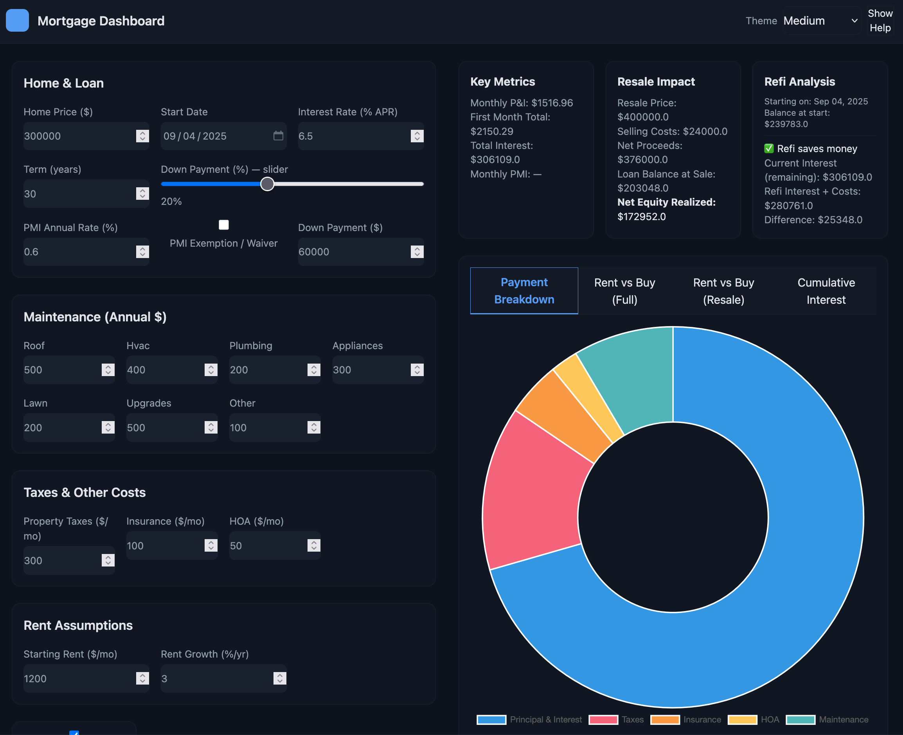

# 🏠 Mortgage Dashboard

An interactive **Mortgage & Rent vs Buy calculator** built with **Flask**, **HTMX**, **TailwindCSS**, and **Chart.js**.  
It provides instant updates, themed charts, amortization tables, and exportable PDF reports.

---

## ✨ Features

- 🔄 **Live Updates with HTMX** — no "Calculate" button, results auto-refresh as you type  
- 🎨 **Theme Switcher** — Light / Medium / Dark modes with persisted choice  
- 📊 **Interactive Charts**:
  - Payment Breakdown (PI/TI/HOA/PMI)
  - Rent vs Buy (with optional resale scenario)
  - Cumulative Interest
- 📑 **Amortization Table** — pageable view of monthly details (P, I, PMI, balance, etc.)  
- 🏷 **Scenario Inputs**:
  - Home price, interest rate, term, start date
  - Down payment % + $ (synced)
  - PMI toggle / waiver
  - Property tax, insurance, HOA, maintenance
  - Rent growth assumptions
  - Resale date, value, and selling costs
  - Tax deduction toggle
  - Refinance comparison
- 📄 **Export to PDF** — full amortization schedule and charts for sharing or printing  
- 📱 **Responsive Design** — works on desktop, tablet, or phone

---

## 🚀 Getting Started

### 1. Clone and install

```bash
git clone https://github.com/yourname/mortgage-dashboard.git
cd mortgage-dashboard
python3 -m venv .venv
source .venv/bin/activate
pip install -r requirements.txt

flask --app app run --debug
Visit http://127.0.0.1:5000 in your browser.


mortgage-dashboard/
├── app.py              # Flask entrypoint
├── calculator.py       # Finance math helpers (payments, amortization, PMI)
├── report.py           # PDF export via reportlab
├── templates/
│   ├── base.html       # Layout + header + theme switcher
│   ├── index.html      # Main dashboard page with form
│   └── _results.html   # HTMX partial swap for results
├── static/
│   └── charts.js       # Chart.js setup + theme-aware rendering
├── requirements.txt
└── README.md


🧩 Tech Stack

Flask
 — backend
HTMX
 — dynamic front-end updates without a SPA
TailwindCSS
 — styling
Chart.js
 — charts
ReportLab
 — PDF generation


Demo
Here is a working live demo:

  
*(Light theme — try Medium & Dark too!)*
---
Non-Commercial License

Copyright (c) 2025 [David Burnett]

Permission is hereby granted, free of charge, to any person obtaining a copy
of this software and associated documentation files (the "Software"), to use,
copy, modify, and distribute the Software, subject to the following conditions:

1. Non-Commercial Use Only
   The Software may not be sold, sublicensed, or used for any commercial
   purposes, including but not limited to offering paid services, creating
   commercial products, or redistributing for a fee.

2. Attribution
   You must retain the above copyright notice and this license in all copies
   or substantial portions of the Software.

3. No Warranty
   THE SOFTWARE IS PROVIDED "AS IS", WITHOUT WARRANTY OF ANY KIND, EXPRESS OR
   IMPLIED, INCLUDING BUT NOT LIMITED TO THE WARRANTIES OF MERCHANTABILITY,
   FITNESS FOR A PARTICULAR PURPOSE AND NONINFRINGEMENT. IN NO EVENT SHALL
   THE AUTHORS OR COPYRIGHT HOLDERS BE LIABLE FOR ANY CLAIM, DAMAGES OR OTHER
   LIABILITY, WHETHER IN AN ACTION OF CONTRACT, TORT OR OTHERWISE, ARISING
   FROM, OUT OF, OR IN CONNECTION WITH THE SOFTWARE OR THE USE OR OTHER
   DEALINGS IN THE SOFTWARE.


